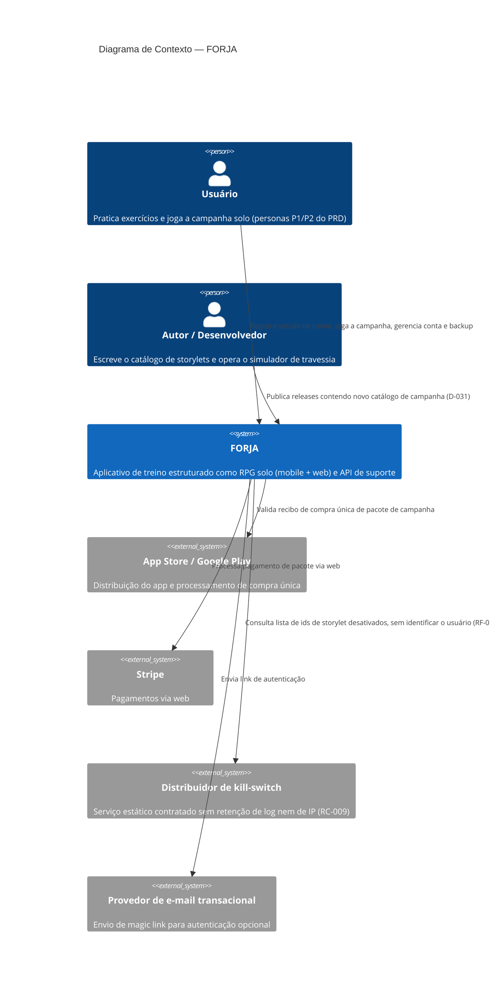

# C4 — Nível 1: Diagrama de Contexto

Visão do FORJA como uma caixa preta, mostrando quem interage com ele e quais sistemas externos ele depende.

## Notas

- Não há usuários "administradores" externos no sistema em produção — o "Autor/Desenvolvedor" publica conteúdo por release do app (D-031), não por um painel administrativo em produção.
- Não existe integração com wearables/Health Connect/HealthKit no MVP (D-003) — de propósito, para não expandir a superfície de dado sensível.
- O sistema não tem qualquer canal de rede social interno (D-001, D-014) — o compartilhamento é sempre via folha nativa do SO, fora do escopo desta arquitetura de backend.
