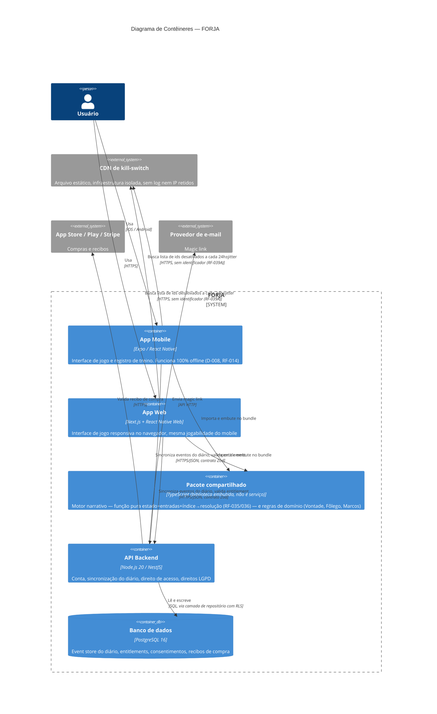

# C4 — Nível 2: Diagrama de Contêineres

## Notas de leitura

- O **pacote compartilhado** não é um contêiner implantável no sentido estrito do C4 (não roda como processo isolado) — está listado aqui porque é uma unidade arquitetural de primeira importância: é ele que garante que RF-036 (função pura, sem I/O) se comporte identicamente nos dois clientes. Ver ADR-0001.
- O contêiner **CDN de kill-switch** é desenhado deliberadamente fora do perímetro do FORJA-como-sistema-autenticado — ele nunca deve ter acesso a `user_id`, sessão ou log de aplicação. Ver ADR-0004.
- A **API Backend** não participa da jogabilidade em nenhum momento — RF-020 a RF-025 (seleção e resolução de storylet) rodam inteiramente no pacote compartilhado, no dispositivo do usuário.
