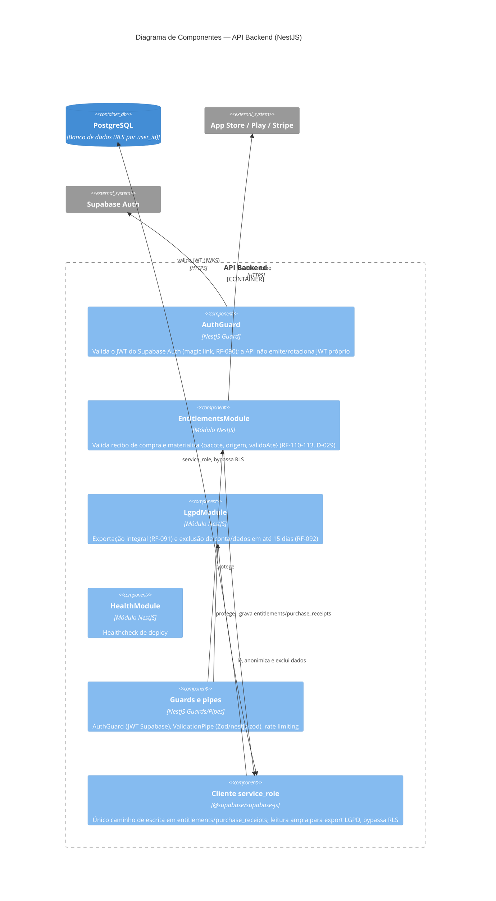

# C4 — Nível 3: Componentes — API Backend

## Decisões relevantes deste nível

- ADR-0011: a API não implementa `SyncModule` nem `ConsentModule` — `diary_events` e `consent_events` são gravados pelo cliente direto via Supabase SDK, protegidos por RLS (`auth.uid()`), conforme os GRANTs de `20260726121100_grants_defesa_em_profundidade.sql`. A API só cobre módulos que exigem `service_role` ou lógica de servidor.
- ADR-0002 (event sourcing) explica por que a escrita de eventos é só append, nunca merge — válido independente de estar na API ou no cliente.
- ADR-0006 explica o uso de Row-Level Security; a API usa `service_role` deliberadamente só onde a RLS não pode se aplicar (ex.: agregar entitlements de todas as origens, ADR-0005).
- ADR-0009 explica o uso de Zod como contrato compartilhado validado pelos guards/pipes.
