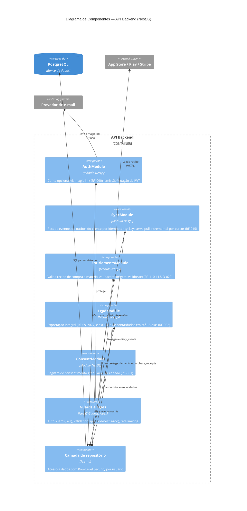

# C4 — Nível 3: Componentes — API Backend

## Decisões relevantes deste nível

- ADR-0002 (event sourcing) explica por que o `SyncModule` só faz append, nunca merge.
- ADR-0006 explica o uso de Row-Level Security na camada de repositório.
- ADR-0009 explica o uso de Zod como contrato compartilhado validado pelos guards/pipes.
