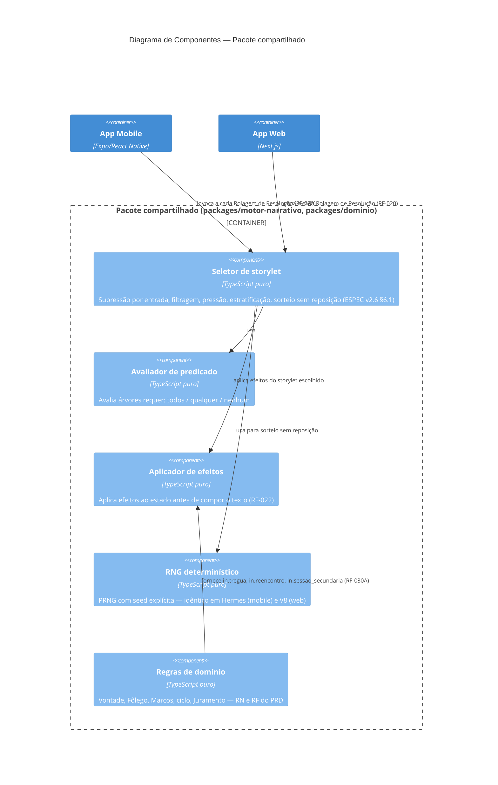

# C4 — Nível 3: Componentes — Pacote compartilhado (motor narrativo + domínio)

## Restrição de arquitetura (D-033, RF-035)

Nenhum componente deste pacote conhece treino, ficha, ciclo ou tela. A única forma de entrada é `estado + entradas + índice`; a única saída é `resolução`. Isso é o que torna o simulador (RF-100-103) e os testes de propriedade possíveis sem instanciar o app inteiro — e é o que garante paridade de comportamento entre mobile e web sem duplicar lógica (ver ADR-0001).
