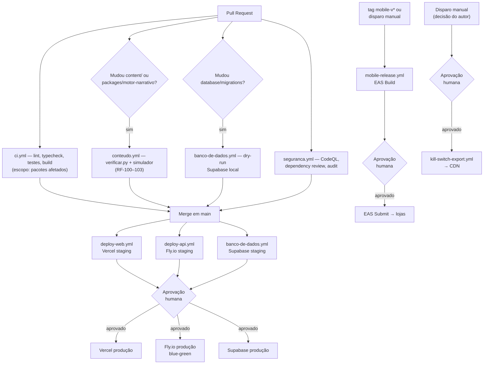

# CI/CD — FORJA (GitHub Actions)

Estratégia de pipeline para os componentes do sistema descritos em `../c4/` e `../database/`. Os arquivos em `.github/workflows/` estão prontos para copiar direto para a raiz do monorepo (`.github/workflows/`).

## Princípios

1. **Escopo proporcional ao tamanho da mudança.** O Turborepo detecta pacotes afetados (ADR-0013); pipelines especializados (conteúdo, banco) só disparam quando os caminhos relevantes mudam. Nada roda "por garantia" em todo PR.
2. **Staging é automático; produção é um ato consciente.** Toda superfície que toca dado real de usuário ou é cara de reverter (API, banco, mobile, kill-switch) sobe em staging sem fricção e espera aprovação humana antes de produção (ADR-0015).
3. **Mobile não é deploy contínuo.** Release mobile só acontece por tag ou disparo manual — nunca como efeito colateral de um merge (ADR-0014, D-031).
4. **As suítes de conteúdo são o portão de publicação.** Não existe revisão editorial separada para o catálogo de storylets — `verificar.py` e o simulador (RF-100–103) são a única defesa, então rodam como checagem obrigatória sempre que o conteúdo muda.
5. **O kill-switch nunca passa pelo pipeline de deploy da API.** É um workflow isolado, disparado manualmente, publicando direto no CDN — coerente com a exigência de infraestrutura sem log/IP retido (ADR-0004).

## Visão geral do pipeline

## Workflows

| Arquivo                  | Dispara em                                          | O que faz                                                            |
| ------------------------ | --------------------------------------------------- | -------------------------------------------------------------------- |
| `ci.yml`                 | todo PR e push em `main`                            | lint, typecheck, teste, build — só nos pacotes afetados              |
| `conteudo.yml`           | PR que toca `content/`, `packages/motor-narrativo/` | `verificar.py` + simulador de travessia (checagem obrigatória)       |
| `banco-de-dados.yml`     | PR/push que toca `database/migrations/`             | dry-run em Supabase local; staging automático; produção com gate     |
| `deploy-web.yml`         | PR/push que toca `apps/web/`, `packages/`           | preview por PR; staging automático; produção com gate                |
| `deploy-api.yml`         | push em `main` que toca `apps/api/`, `packages/`    | build + scan Trivy; staging automático; produção blue-green com gate |
| `mobile-release.yml`     | tag `mobile-v*` ou manual                           | EAS Build; submissão às lojas atrás de um segundo gate               |
| `kill-switch-export.yml` | manual apenas                                       | exporta `storylet_kill_switch` para o CDN, atrás de gate             |
| `seguranca.yml`          | todo PR, push em `main`, semanalmente               | CodeQL, dependency review, `pnpm audit`                              |

## Ambientes do GitHub (Settings → Environments)

Configurados fora do YAML — o workflow só referencia `environment: <nome>`, a regra de proteção vive na configuração do repositório.

| Ambiente       | Proteção                                  | Usado por                                    |
| -------------- | ----------------------------------------- | -------------------------------------------- |
| `staging`      | nenhuma — deploy automático em todo merge | `deploy-web`, `deploy-api`, `banco-de-dados` |
| `producao`     | revisor obrigatório, restrito a `main`    | `deploy-web`, `deploy-api`, `banco-de-dados` |
| `mobile-lojas` | revisor obrigatório                       | `mobile-release` (job de submissão)          |
| `kill-switch`  | revisor obrigatório                       | `kill-switch-export`                         |

## Segredos necessários

Configurados em Settings → Secrets and variables → Actions. Os marcados como _ambiente_ devem ser cadastrados dentro do ambiente correspondente (`staging`/`producao`), não como segredo global do repositório — assim uma credencial de produção nunca fica acessível a um job de staging.

| Segredo                                                       | Escopo                 | Usado por                |
| ------------------------------------------------------------- | ---------------------- | ------------------------ |
| `SUPABASE_ACCESS_TOKEN`                                       | repositório            | `banco-de-dados.yml`     |
| `SUPABASE_DB_PASSWORD_STAGING` / `_PRODUCAO`                  | ambiente               | `banco-de-dados.yml`     |
| `SUPABASE_URL_PRODUCAO`, `SUPABASE_SERVICE_ROLE_KEY_PRODUCAO` | ambiente `kill-switch` | `kill-switch-export.yml` |
| `VERCEL_TOKEN`, `VERCEL_ORG_ID`, `VERCEL_PROJECT_ID_WEB`      | repositório            | `deploy-web.yml`         |
| `FLY_API_TOKEN`                                               | repositório            | `deploy-api.yml`         |
| `CLOUDFLARE_API_TOKEN`, `CLOUDFLARE_ACCOUNT_ID`               | ambiente `kill-switch` | `kill-switch-export.yml` |
| `EXPO_TOKEN`                                                  | repositório            | `mobile-release.yml`     |

Variáveis não sensíveis (`SUPABASE_PROJECT_REF_STAGING`, `SUPABASE_PROJECT_REF_PRODUCAO`) ficam em **Variables**, não em **Secrets** — não precisam de sigilo, só de não ficarem hardcoded no YAML.

## O que fica fora deste pipeline, de propósito

- **Testes E2E completos (Playwright/Detox)** não rodam em todo PR — custo alto demais para o orçamento do projeto (R-002). Ficam como um workflow separado, sob demanda (label no PR) ou noturno, fora do escopo desta primeira versão.
- **EAS Update (OTA)** para correções que não tocam o catálogo (ex.: um crash de UI) é uma ferramenta pontual, usada manualmente pelo autor — não tem workflow dedicado aqui porque não deveria virar rotina (ver ADR-0014).
